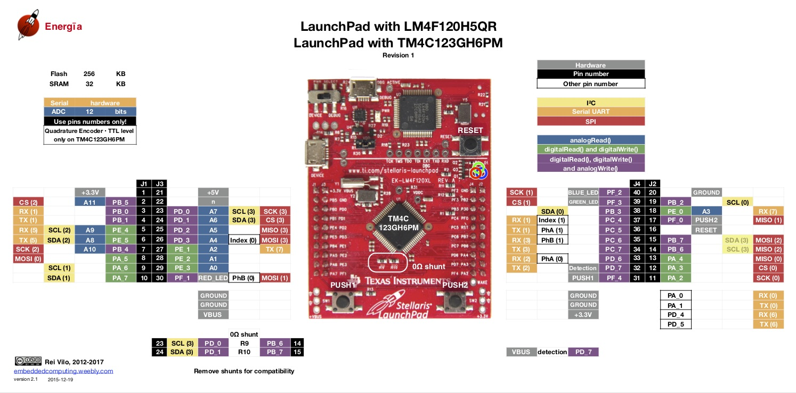

### Pinout of Tiva C Launchpad

### Connection Summary
|Component|Pin|Connected To   |Signal          |Description                             |
|---------|---|---------------|-----------------|----------------------------------------|
|JST6A    |1  |TB1 pin 1      |motor1_M1        |Motor 1 terminal A                      |
|JST6A    |2  |Tiva +3.3 V    |3V3              |Encoder supply                          |
|JST6A    |3  |Tiva PC5       |Encoder1_PHA     |Encoder Channel A                       |
|JST6A    |4  |Tiva PC6       |Encoder1_PHB     |Encoder Channel B                       |
|JST6A    |5  |Tiva GND       |GND              |Common ground                           |
|JST6A    |6  |TB1 pin 2      |motor1_M2        |Motor 1 terminal B                      |
|JST3A    |1  |Tiva PB4       |IN1_motor_driver |Motor 1 input 1                         |
|JST3A    |2  |Tiva PB5       |IN2_motor_driver |Motor 1 input 2                         |
|JST3A    |3  |Tiva PE4       |ENA_motor_driver |Motor 1 enable signal                   |
|JST6B    |1  |TB2 pin 1      |motor2_M2        |Motor 2 terminal A                      |
|JST6B    |2  |Tiva +3.3 V    |3V3              |Encoder supply                          |
|JST6B    |3  |Tiva PF0       |Encoder2_PHA     |Encoder Channel A                       |
|JST6B    |4  |Tiva PD7       |Encoder2_PHB     |Encoder Channel B                       |
|JST6B    |5  |Tiva GND       |GND              |Common ground                           |
|JST6B    |6  |TB2 pin 2      |motor2_M1        |Motor 2 terminal B                      |
|JST3B    |1  |Tiva PB6       |IN3_motor_driver |Motor 2 input 1                         |
|JST3B    |2  |Tiva PB7       |IN4_motor_driver |Motor 2 input 2                         |
|JST3B    |3  |Tiva PD6       |ENB_motor_driver |Motor 2 enable signal                   |
|TB1      |1  |JST6A pin 1    |motor1_M1        |Motor 1 terminal A                      |
|TB1      |2  |JST6A pin 6    |motor1_M2        |Motor 1 terminal B                      |
|TB2      |1  |JST6B pin 1    |motor2_M2        |Motor 2 terminal A                      |
|TB2      |2  |JST6B pin 6    |motor2_M1        |Motor 2 terminal B                      |
|R1       |-  |3.3V ↔ Tiva PB2|4.7kΩ            |Pull-up or signal conditioning          |
|R2       |-  |3.3V ↔ Tiva PB3|4.7kΩ            |Pull-up or signal conditioning          |
|ESP01    |7  |Tiva PB1       |ESP_RX           |UART Recieve(ESP) to UART Transmit(Tiva)|
|ESP01    |2  |Tiva PB0       |ESP_TX           |UART Transmit(ESP) to UART Recieve(Tiva)|
|ESP01    |8  |Tiva +3.3 V    |3V3              |Power ESP01                             |
|ESP01    |1  |Tiva GND       |GND              |Common ground                           |
|ESP01    |4  |Tiva +3.3 V    |ESP_CH_EN        |Enable ESP01 to communicate             |
|MPU9250  |1  |Tiva +3.3 V    |MPU9520_VCC      |Power MPU9250                           |
|MPU9250  |2  |Tiva GND       |GND              |Common ground                           |
|MPU9250  |3  |Tiva PB2       |MPU9520_SCL      |Serial clock of I2C of MPU9250          |
|MPU9250  |4  |Tiva PB3       |MPU9520_SDA      |Serial data of I2C of MPU9250           |
|RLS08    |A1 |Tiva PD0       |Line follower IR1|ADC source of IR1 of Line follower      |
|RLS08    |A2 |Tiva PD1       |Line follower IR1|ADC source of IR1 of Line follower      |
|RLS08    |A3 |Tiva PD2       |Line follower IR1|ADC source of IR1 of Line follower      |
|RLS08    |A4 |Tiva PD3       |Line follower IR1|ADC source of IR1 of Line follower      |
|RLS08    |A5 |Tiva PE1       |Line follower IR1|ADC source of IR1 of Line follower      |
|RLS08    |A6 |Tiva PE2       |Line follower IR1|ADC source of IR1 of Line follower      |
|RLS08    |A7 |Tiva PE3       |Line follower IR1|ADC source of IR1 of Line follower      |
|RLS08    |A8 |Tiva PE0       |Line follower IR1|ADC source of IR1 of Line follower      |
